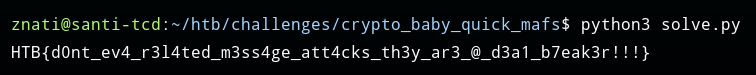

## Baby Quick Mafs

In this challenge, we have a simple code that encrypts a text in three parts with RSA. 

let's analize the code.

- The function **_partition_message_** generate a random m1 and divide the message in m // m1 + 1 blocks, but, the last block is equal to the sum of m1 and remainder (m1 + (m % m1))

```python3
while sum(parts) < m:
    if sum(parts) + m1 < m:
        parts.append(m1)
    else:
        remainder = m - sum(parts)
        parts.append(m1 + remainder)
```

- **_encode_** simply encrypts each block with exponent = 2 and module N

```python3
ciphers = [pow(c, 2, N) for c in parts]
    return (ciphers, remainder)
```

### Solution:

The only message different is the last, so $P1=P2$ $!=P3$

$C1 = P1²$ $mod$ $n$

$C2 = P1²$ $mod$ $n$

$C3 = (P1+r)²$ $mod$ $n$

It's a algebraic identity:

$(P1+r)²$  $mod$ $n$ $=P1²+r²+2rP1$ $mod$ $n$

$2rP1=C3-C1-r²$

$P1=(C3-C1-r²)*2r⁻¹$

Now, just need to joint he messages and get the flag m=p1+p2+r

```python
from Crypto.Util.number import inverse, bytes_to_long, long_to_bytes

n = 6083782486455360611313889289556658208725888944237734041722591252756006664878102248734673207367745303402874595854966731263105387801996693270011840173939423
r = 1081087287982224274239399953615475281184099226198643053396569433856757255106426461817760194704250226883807897800355728788149068771546876055268915238961343
m = [5408283916250636369066846815501131861319520431106165986129813106223074286810632222888292034380612581416458756909119954039579666773680866532576166358987272, 5408283916250636369066846815501131861319520431106165986129813106223074286810632222888292034380612581416458756909119954039579666773680866532576166358987272, 5598555010250184271123226314796180406367795504188162611960100902143581636125416986623404842897202277277978566659455918773104687212096435095590205751904580]

a = m[0]
b = m[1]
c = m[2]

r2Inverse = inverse(2*r,n)

m1 = (r2Inverse*(c-a-pow(r,2)))%n
m = m1+m1+r
print(long_to_bytes(m).decode())
```

---



---


